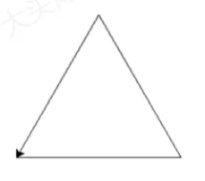
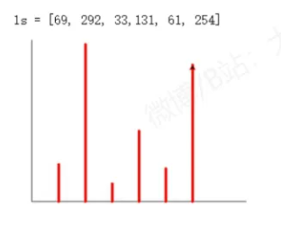
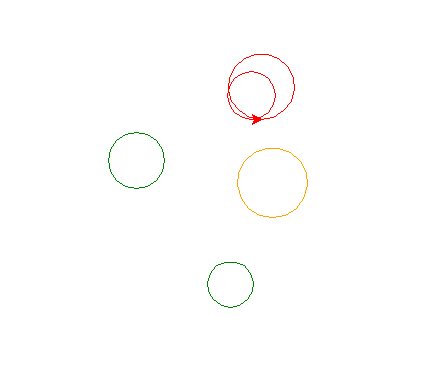

## 00 高频内容

将字典转换成集合
ls = list(d.items())
集合排序
字典排序
sort与lambda结合使用
ls.sort(key=lambda x: x[1], reverse=True)


## 01 

链盘输入一组我国高校所对应的学校类型，以空格分隔，共一行  
示例格式如下：
综合 理工 综合 综合 综合 师 范理工  
统计各类型的数量，从数量多到少的顺序屏幕输出类型及对应数量，以英文冒号分隔，每个类型一行，输出参考格式如下：
综合：4
理工：2
师范：1

```
txt = input("请输入类型序列")

tem = txt.split()
d = {}

for i in range(len(tem)):
    d[tem[i]] = d.get(tem[i], 0)+1

ls = list(d.items())

ls.sort(key=lambda x: x[1], reverse=True)

for k in ls:
    print("{}:{}".format(k[0], k[1]))

```

## 02 
键盘输入小明学习的课程名称及考分等信息，信息间用空格分隔，每个课程一行，行回车结束录入，
示例格式如下：  
> 数学 90  
语文 95  
英语 86  
物理 84  
生物 87

屏幕输出得分最高的课程及成绩，得分最低的课程及成绩，及干均分（保留2位小数）。
注意：其中逗号为英文逗号，格式如下：  
最高分课程是语文95，最低分课程是理84，干均分是88.40

```
data = input()
d = {}

while data:
    t = data.split()
    d[t[0]] = t[1]
    data = input()
print(d)

ls = list(d.items())
ls.sort(key=lambda x: x[1], reverse=True)
max_course, max_grade = ls[0]
min_course, min_grade = ls[len(ls)-1]
average_grade = 0
for i in d.values():
    average_grade = average_grade + int(i)
average_grade = average_grade / len(ls)
print("最高分课程是{} {}, 最低分课程是{} {}, 平均分是{:.2f}".format(
    max_course, max_grade, min_course, min_grade, average_grade))
```

## 03 
使用`turtle`库的`turtle.fd()`函和`turtle.seth()`函数绘制一个等边三角形，边长为200像素,效果如下图：

```
import turtle as t

for i in range(3):
    t.seth(i*120)
    t.fd(200)
```

## 04
使用`turtle`库的`turtle.fd()`函和`turtle.seth()`函数绘制一个每方向为100像素长度的十字形,效果如下图：

```
import turtle as t

for i in range(4):
    t.seth(i*90)
    t.fd(100)
    t.fd(-100)

```

## 05 
使用`turtle`库的`turtle.fd()`函和`turtle.seth()`函数绘制一边长为100像素的正八边形,效果如下图：

```
import turtle
turtle.pensize(2)
d = 0
for i in range(1, 9):
    turtle.fd(100)
    d += 360/8
    turtle.seth(d)
```

# 06

使用字典和列表型变量完成村长选举。
某村有40名有选举权和被选举权的村民，名单由考生文件夹下文件`name.txt`给出，从这40名村民中选出一人当村长，40人的投票信息由考生文件夹下`vote.txt`给出，每行是一张选票的信息，有效票中得票最多的村民当选。
问题一：请从`vote.txt`中筛选出无效票写入文件`vote1.txt`。有效票的含义是：选票中只有一个名,且该名字在`name.txt`文件列表中，不是有效票的票称为无效票。
问题二：给出当选村长的名字及其得票数。

```
f = open("/name.txt")
names = f.readlines()
f.close()
f = open("vote.txt")
votes = f.readlines()
f.close()
f.close()

f = open("vote1.txt", "w")
D = {}
NUM = 0
for vote in votes:
    num = len(vote.split())
    if num == 1 and vote in names:
        D[vote[:-1]] = D.get(vote[:-1], 0)+1
        NUM += 1
    else:
        f.write(vote)
f.close()

l = list(D.items())
l.sort(key=lambda s: s[1], reverse=True)
name = l[0][0]
score = l[0][1]
print("有效票数为：{} 当选村长村民为:{},票数为：{}".format(NUM, name, score))
```

## 07 
使用 `turtle`库的`turtle.fd()`和`turtle.seth()`函绘制一个边长为100的正五边形

## 08
使用字典和列表型量完成最有人气的明星的投票居分析。投信息由考生文件夹下文件给出，一行只有一个明星姓名的投票才是有效票，有效票中得票最多的明星当选最有人气的明星。
间题一：请统计有效票张数。（7分）
问题二：请给出当选最有人气明星的姓名和票数。（8分）

## 09 
画图

## 10

计算两个列表1s和1t对应元素乘积的和（即向量积）  
`1s=[111,222,333,444,555,666,777,888,999]`  
`1t=[999,888,777,666,555,444,333,222,111]`
```
ls = [111, 222, 333, 444, 555, 666, 777, 888, 999]
lt = [999, 777, 555, 333, 111, 888, 666, 444, 222]
s = 0
for i in range(len(ls)):
    s += (ls[i] * lt[i])
print(s)
```

## 13  
根据列表中保存的数据采用turtle库画直方图，效果如图：  

```import turtle as t
ls = [69, 292, 33, 131, 61, 254]
X_len = 400
Y_len = 300
x0 = -200
y0 = -100

t.penup()
t.goto(x0, y0)
t.pendown()

t.fd(X_len)
t.fd(-X_len)
t.seth(90)
t.fd(Y_len)

t.pencolor('red')
t.pensize(5)
for i in range(len(ls)):
    t.penup()
    t.goto(x0 + (i+1)*50, y0)
    t.seth(90)
    t.pendown()
    t.fd(ls[i])
t.done()
```

## 14

在已定义号的字典pdict里有一些人名及其电话号码。请用户输入一个人代姓名，在字典中查找该用户的信息，如果找到，生成一个四位数字的验证码，并将名字、电话号码和验证码输出在屏幕上，如示例所示。如果找不到该用户的信息，则显示`对不起，您输入的用户信息不存在`。示例如下：
> 输入：
> Bob
> 输出：
> Bob 234567891 1926
>
> 输入：bob
> 输出：
> 对不起，您输入的用户信息不存在。

```
import random
random.seed(2)

pdict= {'Alice':['123456789'],
        'Bob':['234567891'],
        'Lily':['345678912'],
        'Jane':['456789123']}

name = input('请输入一个人名:')
if name in pdict:
    print("{} {} {}".format(name,pdict.get(name)[0],random.randint(1000,9999)))
else:
    print("对不起，您输入的用户信息不存在。")
```

## 15

利用random库和turtle库，在屏幕上绘制5个圆圈，圆的半径和圆心的坐标由randint()函数产生，圆心的X和Y坐标范围在[-100,100]之间；半径的大小范围在[20,50]之间，圆圈的颜色随机在color列表里选择。
效果如下图：



```
import random as r
import turtle as t

color = ['red', 'orange', 'blue', 'green', 'purple']
r.seed(1)
for i in range(5):
    rad = r.randint(20, 50)
    x0 = r.randint(-100, 100)
    y0 = r.randint(-100, 100)
    t.color(r.choice(color))
    t.penup()
    t.goto(x0, y0)
    t.pendown()
    t.circle(rad)
t.done()

```

## 16
* 此题目有问题 *
定义了一个6个浮点数的一维列表1t1和一个包含3个数的一维列表1t2。
示例如下：
1t1=[0.69,0.292,0.33,0.131,0.61,0.254]
1t2=[0.1,0.8,0.2]
完成如下功能：
计算1t1列表跟1t2列表的向量内积,两个向量X:[x1,x2,x3]和Y=[y1,y2,y3]的内积计算公式如下:`k=x1*y1+x2*y2+x3*y3`

将每次计算的两组对应元的值、以及对应元乘积的计和k的值显示在屏幕上，格式如下所
第一步计算第一个k，分为3次累计1t2[0]*1t1[0+0],1t2[1]*1t1[0+1],1t2[2]*1t1[0+2]的和。
k=0.069，filter[0]=0.100，img[0+0]=0.690
k=0.303，filter[1]=0.800，img[0+1]=0.292
k=0.369，filter[2]=0.200，img[0+2]=0.330
...(略)

## 17 
利用random和turtle在屏幕上绘制4个小雪花，雪花的中心点坐标由列表points给出，雪花的半径长度由randint()函数产生。
雪花的顔色是红色。效果如下图所示。


```
import turtle as t
import random as r

r.seed(1)
t.pensize(2)
t.pencolor('red')
angles = 6
points= [[0,0],[50,40],[70,80],[-40,30]]

for i in range(4):
    x0,y0 = points[i]
    t.penup()
    t.goto(x0, y0)
    t.pendown()

    length = r.randint(6, 16)
    for j in range(angles):
        t.fd(length)
        t.bk(length)
        t.right(360 / angles)
t.done()
```

## 18
在考生文件夹下有个文件`data18.txt`,其中记录了2019年QS全大学排名前20名的学校信息。
示例如下：
> 1，麻省理工学院，美国  
2，斯坦福大学，美国  
3，哈佛大学，美国

第一列为排名，第2列为学校名称，第3列为学校所属的国家，字段之间用逗号`,`隔开。

程序读取`data18.txt`文件内容，统计出现的国家个数以及每个国家上榜大学的数量及名称，输出结果格式示例如下：
英国：5：牛津大学 刽桥大学 帝国理工学院 伦敦大学学院 爱丁堡大学
瑞士：1：苏黎世联邦理工学院
...

```
f = open('data18.txt','r')

school = []
country = []
for line in f:
    lines = line.strip('\n').split(",")
    if lines != ['']:
        school.append(lines[1:3]) # 构建学校列表
        country.append(lines[-1]) # 构建国家列表
        
country = list(set(country)) # 列表去重复

unis = []
for i in country:
    n = 0
    schools = []
    result = []
    for k in school:
        if k[1] == i:
            n += 1
            schools.append(k[0])
    result = [i, n, schools]
    unis.append(result)

for d in unis:
    print('{:>4}: {:>4} : {}'.format(d[0],d[1],''.join(d[2])))
          
f.close()
```