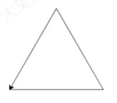

## 01 

链盘输入一组我国高校所对应的学校类型，以空格分隔，共一行  
示例格式如下：
综合 理工 综合 综合 综合 师 范理工  
统计各类型的数量，从数量多到少的顺序屏幕输出类型及对应数量，以英文冒号分隔，每个类型一行，输出参考格式如下：
综合：4
理工：2
师范：1

```
txt = input("请输入类型序列")

tem = txt.split()
d = {}

for i in range(len(tem)):
    d[tem[i]] = d.get(tem[i], 0)+1

ls = list(d.items())

ls.sort(key=lambda x: x[1], reverse=True)

for k in ls:
    print("{}:{}".format(k[0], k[1]))

```

## 02 
键盘输入小明学习的课程名称及考分等信息，信息间用空格分隔，每个课程一行，行回车结束录入，
示例格式如下：  
> 数学 90  
语文 95  
英语 86  
物理 84  
生物 87

屏幕输出得分最高的课程及成绩，得分最低的课程及成绩，及干均分（保留2位小数）。
注意：其中逗号为英文逗号，格式如下：  
最高分课程是语文95，最低分课程是理84，干均分是88.40

```
data = input()
d = {}

while data:
    t = data.split()
    d[t[0]] = t[1]
    data = input()
print(d)

ls = list(d.items())
ls.sort(key=lambda x: x[1], reverse=True)
max_course, max_grade = ls[0]
min_course, min_grade = ls[len(ls)-1]
average_grade = 0
for i in d.values():
    average_grade = average_grade + int(i)
average_grade = average_grade / len(ls)
print("最高分课程是{} {}, 最低分课程是{} {}, 平均分是{:.2f}".format(
    max_course, max_grade, min_course, min_grade, average_grade))
```

## 03 
使用`turtle`库的`turtle.fd()`函和`turtle.seth()`函数绘制一个等边三角形，边长为200像素,效果如下图：

```
import turtle as t

for i in range(3):
    t.seth(i*120)
    t.fd(200)
```

## 04
使用`turtle`库的`turtle.fd()`函和`turtle.seth()`函数绘制一个每方向为100像素长度的十字形,效果如下图：

```
import turtle as t

for i in range(4):
    t.seth(i*90)
    t.fd(100)
    t.fd(-100)

```

## 05 
使用`turtle`库的`turtle.fd()`函和`turtle.seth()`函数绘制一边长为100像素的正八边形,效果如下图：

```
import turtle
turtle.pensize(2)
d = 0
for i in range(1, 9):
    turtle.fd(100)
    d += 360/8
    turtle.seth(d)
```

# 06

使用字典和列表型变量完成村长选举。
某村有40名有选举权和被选举权的村民，名单由考生文件夹下文件`name.txt`给出，从这40名村民中选出一人当村长，40人的投票信息由考生文件夹下`vote.txt`给出，每行是一张选票的信息，有效票中得票最多的村民当选。
问题一：请从`vote.txt`中筛选出无效票写入文件`vote1.txt`。有效票的含义是：选票中只有一个名,且该名字在`name.txt`文件列表中，不是有效票的票称为无效票。
问题二：给出当选村长的名字及其得票数。

```
f = open("/name.txt")
names = f.readlines()
f.close()
f = open("vote.txt")
votes = f.readlines()
f.close()
f.close()

f = open("vote1.txt", "w")
D = {}
NUM = 0
for vote in votes:
    num = len(vote.split())
    if num == 1 and vote in names:
        D[vote[:-1]] = D.get(vote[:-1], 0)+1
        NUM += 1
    else:
        f.write(vote)
f.close()

l = list(D.items())
l.sort(key=lambda s: s[1], reverse=True)
name = l[0][0]
score = l[0][1]
print("有效票数为：{} 当选村长村民为:{},票数为：{}".format(NUM, name, score))
```

## 07 
使用 `turtle`库的`turtle.fd()`和`turtle.seth()`函绘制一个边长为100的正五边形

## 08
使用字典和列表型量完成最有人气的明星的投票居分析。投信息由考生文件夹下文件给出，一行只有一个明星姓名的投票才是有效票，有效票中得票最多的明星当选最有人气的明星。
间题一：请统计有效票张数。（7分）
问题二：请给出当选最有人气明星的姓名和票数。（8分）

## 09 
画图

## 10

计算两个列表1s和1t对应元素乘积的和（即向量积）  
`1s=[111,222,333,444,555,666,777,888,999]`  
`1t=[999,888,777,666,555,444,333,222,111]`
```
ls = [111, 222, 333, 444, 555, 666, 777, 888, 999]
lt = [999, 777, 555, 333, 111, 888, 666, 444, 222]
s = 0
for i in range(len(ls)):
    s += (ls[i] * lt[i])
print(s)
```